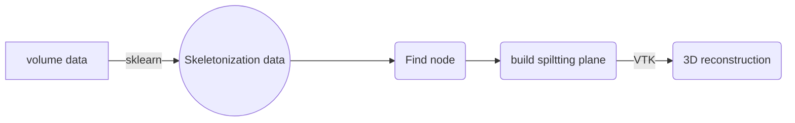

# Couinaud-visualization
Couinaud classification of liver visualization based on CT data

# Issue History

The Couinaud classification describe the functional liver anatomy (preferred over morphological liver anatomy).

The middle hepatic vein also demarcates the true right and left lobes. The right lobe is further divided into an anterior and posterior segment by the right hepatic vein. The left lobe is divided into the medial and lateral segments by the left hepatic vein. The fissure for the ligamentum teres also separates the medial and lateral segments. The medial segment is also called the quadrate lobe. In the widely used Couinaud (or "French") system, the functional lobes are further divided into a total of eight subsegments based on a transverse plane through the bifurcation of the main portal vein. The caudate lobe is a separate structure which receives blood flow from both the right- and left-sided vascular branches.

## Method
Input：liver volume data  hepatic volume data，portal volume data (Data that ITK can read)
 Output：couinaud classification of liver visualization 
  
Event process：
1. Skeleton the input vascular tree；
2. Find the bifurcation point and root node of hepatic and portal vascular tree;
3. Take the vertical direction of the root node and the bifurcation node as the splitting plane;
4. Perform 3D reconstruction of liver mask data based on VTK, construct the cut surface formed in the previous step, segment the 3D model of the liver, and color different parts of the liver after segmentation in different colors

And this will produce a flow chart:

## User Guide

 1. Enter according to the prompt or find the input data locally (the data  that ITK can be read, ex: mha, nrrd, nii etc.)

 3. Click "Browse" to search locally, select the files of the liver, hepatic vein and portal vein of the case to be segmented to complete the path.

 4. After filling in the file path, click "OK", wait for a minute, you can get a 3D visual display of the couinaud classificationresults

## Visualization

